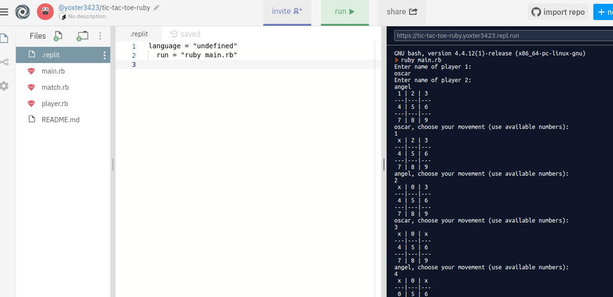
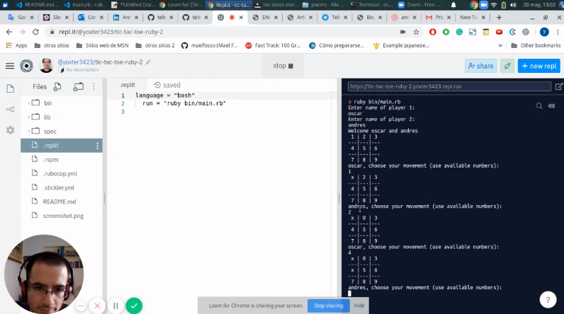

# Tic-tac-toe-ruby

Sixth Ruby Microverse Project By Ángel Cussi &amp; Oscar Russi.

# Tic-tac-toe-ruby testing

Sixth Microverse project for Ruby Curriculum.

# What it does

- Play the famous tic-tac-toe game in the terminal.

# HOW TO PLAY

- Tic tac toe is a game for two players, the game is played in a board of 3 x 3 cells.
- First players use X symbol.
- The second player uses 0 symbol.
- Each player can fill a cell with his/her symbol.
- The goal of both players is two add his/her symbol in the same row, column or one of the main diagonals.
- The first player who achieves this goal wins the game.
- If no empty cell and no players have achieved the goal then the game finish with a draw.

# INSTRUCTIONS

1) Input name of the first player.
2) Input name of the second player. It must be different from the first player name.
3) The first player chooses the cell he wants to use.
4) Each cell has a number.
5) The cell will be renamed with an X or an O if you selected and it is valid.
6) You aren't able to select a cell if it already takes it.
7) When the game ends you can choose if you want to play again or not.

# HOW TO RUN THE GAME
- **Click on the demo link below and execute the game.**
- **you have to click on the run button ahead in the navbar.**
- **wait for the game.** 
- **you can play.**

## Built With

- Ruby.

#### And deployed to GitHub

## Unit tests

- In the terminal, go to the project folder and type 'rspec' to run the tests.

## Future improvements

- Allow to change player names when a new game will begin.
- Add 'choose first player' option to allow defining which player will play first.

## Project Presentation (VIDEO)

[presentation](https://www.loom.com/share/217ab368381e47a992dc8b8015a59ae6)

## Live Demo

[Live Demo](https://repl.it/@yoxter3423/tic-tac-toe-ruby-2)

## Authors

**Ángel Cussi**
- Github: [@profile](https://github.com/abcussi)
- Twitter: [@profile](https://twitter.com/thecussi)
- Linkedin: [profile](https://www.linkedin.com/in/angel-cussi-1b2310174/)

**Oscar Russi**
- Github: [@andresporras3423](https://github.com/andresporras3423/)
- Linkedin: [Oscar Russi](https://www.linkedin.com/in/oscar-andr%C3%A9s-russi-porras-053236167/)

## 🤝 Contributing

This is a project for educational purposes only. We are not accepting contributions.

## Attributions and Credit

Special thanks to Microverse, for this learning opportunity. 

## Show your support

Give a ⭐️ if you like this project!

## Enjoy!
